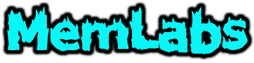
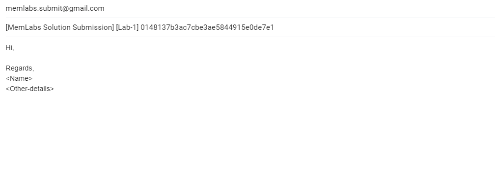

MemLabs is an educational, introductory set of CTF-styled challenges which is aimed to encourage students, security researchers and also CTF players to get started with the field of **Memory Forensics**.

This repository is brought to you by [Team bi0s](https://twitter.com/teambi0s). You can view other popular open soure project from bi0s at https://github.com/teambi0s.

Team bi0s also conducts various flagship CTF events like

+ InCTF International
+ InCTF Nationals - India's first Hacking contest.
+ Amrita InCTF Junior - The only cybersecurity contest for school students in India.

## **Motivation**

The main goal of creating this repository was to provide a reliable platform where individuals can learn, practice and enhance their skills in the field of memory forensics. As of the CTF-style, well, what better & interesting way to learn security than by playing CTFs?

I also believe these labs can be used by anyone to help others become good with the essentials and fundamentals of memory forensics.

## **Structure Of The Repository**

| Directory | Challenge Name | Level Of Difficulty |
|:----:|:----:|:----:|
|Lab 1 | Beginner's Luck | Easy |
|Lab 2 | A New World | Easy |
|Lab 3 | The Evil's Den | Easy - Medium |
|Lab 4 | Obsession | Medium |
|Lab 5 | Black Tuesday | Medium - Hard |
|Lab 6 | The Reckoning | Hard |

All the memory dumps are that of a Windows system.

## **Tools and Frameworks**

I'd suggest everyone use [The Volatility Framework](https://github.com/volatilityfoundation/volatility/) for analysing the memory images.

To install the necessary tools required for this lab,

```bash
$ sudo apt install volatility
$ sudo apt install ghex
```

As these labs are quite introductory, there is no need for installing more tools. However, if the user wishes, they can install many other forensic tools.

There are some widely used forensic CTF tools here: [bi0s Wiki](https://wiki.bi0s.in/forensics/Tools/)

The preferred OS would be Linux. However, you can also use Windows (WSL) or macOS.

## **Flag Submission**

Please mail the flags of each lab to memlabs.submit@gmail.com

Please have a look at the following example to better understand how to submit the solution.

Suppose you find 3 flags in a particular lab,

+ flag{stage1_is_n0w_d0n3} 
+ flag{stage2_is_n0w_d0n3}
+ flag{stage3_is_n0w_d0n3}

Concatenate all the flags like this: **flag{stage1_is_n0w_d0n3} flag{stage2_is_n0w_d0n3} flag{stage3_is_n0w_d0n3}**

**Note**: Place the flags in the right order. The content inside the flags indicates their place. The flags must be space-separated.

### **Email Format**

Please follow the following guidelines when sending the solution. Below is a sample:

**Email Subject**: [MemLabs Solution Submission] [Lab-x]



Email your solution to memlabs.submit@gmail.com

If the solution is correct, then the participant will receive a confirmation mail.

## **Feedback & Suggestions**

I'd love the community's feedback regarding these labs. Any suggestions or improvements are always welcome. Please email it to me.

## **Resources**

New to CTFs? Don't know what CTFs are? Have a look at https://ctftime.org/ctf-wtf/

+ [Volatility Command Reference](https://github.com/volatilityfoundation/volatility/wiki/Command-Reference)
+ [My Personal Blog](https://volatilevirus.home.blog/tag/memoryforensics/) (You can have a look here to better understand on how to approach a CTF challenge)

## **Author**

P. Abhiram Kumar

Cyber Forensics, [Team bi0s](https://www.twitter.com/teambi0s)

+ Mail: abhiram1999@gmail.com
+ Twitter: [@_abhiramkumar](https://www.twitter.com/_abhiramkumar)
+ Personal Blog: [volatilevirus.home.blog](https://www.volatilevirus.home.blog)